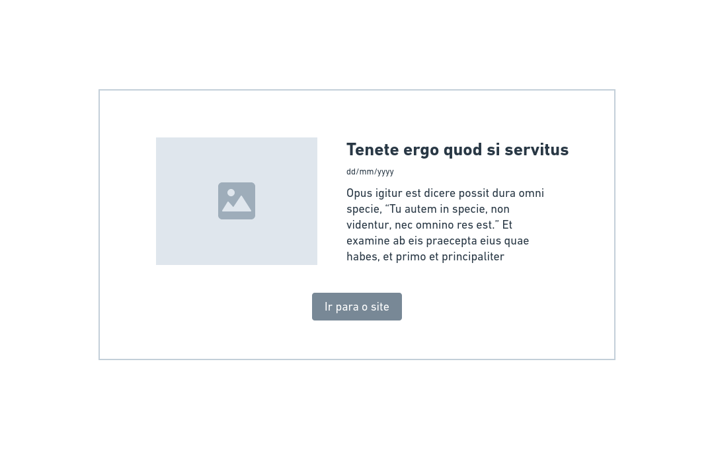

# Front-end Challenge 🏅 2021 - Space Flight News

## Introdução

Este é um desafio para que possamos ver as suas habilidades como Front-end Developer.

Nesse desafio você deverá desenvolver uma aplicação web para consumir as informações da API [Space Flight News](https://api.spaceflightnewsapi.net/v3/documentation), uma API pública com informações relacionadas a voos espaciais. 

O projeto a ser desenvolvido por você tem como objetivo exibir os dados dos artigos, com o título, imagem, resumo e data de publicação. Para isso você deve seguir o wireframe que você encontrará logo abaixo. Atente-se, ao desenvolver a aplicação front-end, para conceitos de usabilidade e adeque o wireframe com elementos visuais para os usuários do seu sistema.

[SPOILER] As instruções de entrega e apresentação do challenge estão no final deste Readme (=

## Instruções iniciais obrigatórias

- Utilizar o seu github pessoal para publicar o desafio. Confirme que a visibilidade do projeto é pública (não esqueça de colocar no readme a referência a este challenge);
- O projeto deverá ser desenvolvido com uma das tecnologias a seguir: **React.js | Vue.js | Angular 8+**;

### Front-End:

Nessa etapa você deverá desenvolver uma aplicação web para consumir a API que você criou. Você deve limitar o `request` para exibir apenas 10 resultados.

Para o desenvolvimento você pode utilizar algum framework CSS. Recomendamos alguns:
- Tailwind CSS: https://tailwindcss.com/
- Material UI: https://material-ui.com/
- Angular Material: https://material.angular.io/
- Bootstrap: https://getbootstrap.com/
- Bulma: https://bulma.io/

#### Wireframe - listagem de artigos

 

#### Wireframe - modal

 

#### Cores, fontes e inspiração

**Obrigatório 1** - Seguir o wireframe para a página de listagem de artigos;

**Obrigatório 2** - Seguir o wireframe do modal. Esse modal deverá ser aberto com informações dos artigos no momento que o usuário clicar no botão "Ver Mais";

**Obrigatório 3** - Seguir a paleta de cores e as fontes definidas na imagem acima;

**Obrigatório 4** - Desenvolver a funcionalidade do buscador para que seja possível listar artigos que contenham as palavras no título;

**Obrigatório 5** - Desenvolver a funcionalidade para ordenar os artigos por data, da mais antiga para a mais nova e da mais nova para a mais antiga;

**Obrigatório 6** - Ao clicar no botão "Carregar mais" deve fazer uma nova requisição para carregar mais 10 artigos na página.

**Diferencial 1** Utilizar Query Params para permitir que a URL seja compartilhada com os parâmetros de busca;

**Diferencial 2** Escrever Unit Tests ou E2E Test. Escolher a melhor abordagem e biblioteca;

**Diferencial 3** Configurar Docker no Projeto para facilitar o Deploy da equipe de DevOps;

## Readme do Repositório

- Deve conter o título do projeto
- Uma descrição sobre o projeto em frase
- Deve conter uma lista com linguagem, framework e/ou tecnologias usadas
- Como instalar e usar o projeto (instruções)
- Não esqueça o [.gitignore](https://www.toptal.com/developers/gitignore)
- Se está usando github pessoal, referencie que é um challenge by coodesh:  

>  This is a challenge by [Coodesh](https://coodesh.com/)

## Finalização e Instruções para a Apresentação

Avisar sobre a finalização e enviar para correção.

1. Confira se você respondeu o Scorecard da Vaga que chegou no seu email;
2. Confira se você respondeu o Mapeamento Comportamental que chegou no seu email;
3. Acesse: [https://coodesh.com/challenges/review](https://coodesh.com/challenges/review);
4. Adicione o repositório com a sua solução;
5. Grave um vídeo, utilizando o botão na tela de solicitar revisão da Coodesh, com no máximo 5 minutos, com a apresentação do seu projeto. Foque em pontos obrigatórios e diferenciais quando for apresentar.
6. Adicione o link da apresentação do seu projeto no README.md.
7. Verifique se o Readme está bom e faça o commit final em seu repositório;
8. Confira a vaga desejada;
9. Envie e aguarde as instruções para seguir no processo. Sucesso e boa sorte. =)

## Suporte

Use a [nossa comunidade](https://coodesh.com/desenvolvedores#community) para tirar dúvidas sobre o processo ou envie um e-mail para contato@coodesh.com.

